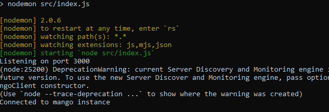
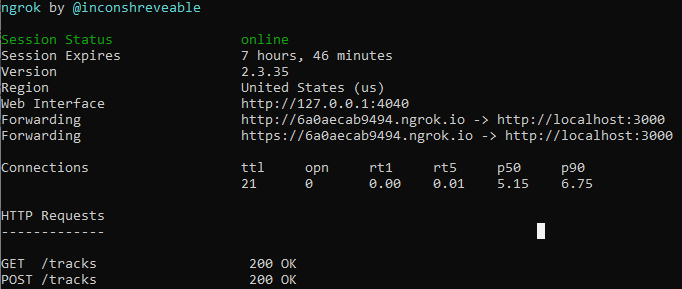

# Nutrition App in React Native with MongoDB

## Table of contents

- [General info](#general-info)
- [Technologies](#technologies)
- [Setup](#setup)
- [Run](#run)

## General info

Application for learning and Engineer's Thesis React Native with MongoDB.

## Technologies

- React Native
- MongoDB

## Setup

To run this project, install it locally for both - <a href="https://github.com/PrzemekCraker/nutrition-app">app</a> and <a href="https://github.com/PrzemekCraker/nutrition-app-server">server</a> - using npm:

```
$ cd ../nutrition-app
$ npm install

```

```
$ cd ../nutrition-app-server
$ npm install

```

## Run

To run the application, we need the 'track-server' folder in which we enable nodemon listening via the command

```
$ cd ../nutrition-app-server
$ npm run dev

```



In app directory run the ngrok (public URL) via command

```
$ cd ../nutrition-app
$ ngrok http 3001

```

Then copy forwarding link url to tracker.js -> baseURL



Finally, launch the application

```
$ cd ../nutrition-app
$ npm start

```
